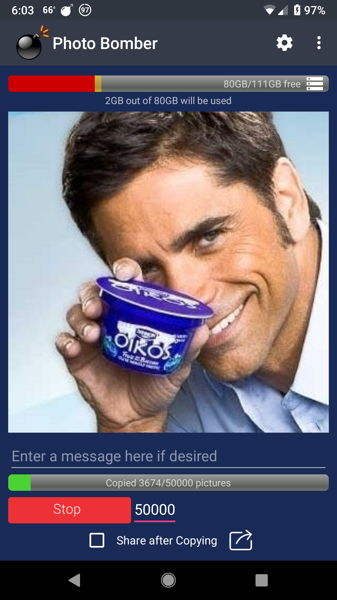

# Photo Bomber
The only thing better than sending your friends a dank picture of Dr. Phil is sending them a hundred pictures of him at the click of a button!
The app is relatively simple.  First you either start a share intent from your gallery app of choice to Photo Bomber, or open the app and hit the browse button to search for a picture to copy and send.  Next you can select how many pictures you would like copied, hit the start button, and a new directory will be created to store your copied photos.  If you have the checkbox selected to share after copying, a share intent will be launched and will send all the pictures you just copied to whoever you choose.

# What still needs to be done
I would like to add better lifecycle support to give the app a more polished and consistent feel when it is closed and reopened.  I would also like to add an optional feature to delete the copied pictures after they are shared automatically.  Two other things high on the list of importance are to bind the preferences to the descriptions in the settings activity and to implement an optional safety feature that will not let you start a copy operation that will leave you with less than a user defined amount of available storage space.  Also, I would like to make the code more "Kotlin-ish" and modular.  I am new to Kotlin and the code reflects it.  There is a lot of room for improvement but right now these are my main priorities for when I get the chance to work on this again.
# Contributing
Realistically, I know that little if any of you are going to use, much less wish to contribute to, this app.  However, if you see something that could use improvement, feel free to raise an issue and if you wish to contribute, mention that you are willing to help.  Please always be respectful to others who visit this repo.  I had an entire code of conduct written, but decided to omit it because it was very long and, admittedly, both ridiculous and obtuse.  Please don't make me have to add it in here or you might find yourself playing Fortnite with me (yes - it really was that ridiculous, granted it makes a lot more sense in the proper context; if you feel I am being disrespectful to you and I disagree, ask about the Fortnite clause...I'm pretty sure you will like what you hear)!  I will entertain contributions from anyone, whether you are a rockstar developer or you just started coding yesterday.  I will even [within reason] hold your hand and walk you through the pull request process if you are more towards the latter end of that spectrum and ask me for help. Don't be afraid to mess up, I don't bite and frankly I don't have enough time to be upset or to let small things disrupt, corrupt or interrupt me; it's really fudging time consuming. I embrace unique perspectives and I look for passion, not perfection :)
 <h3><b>tldr: If you wish to contribute, raise an issue and mention that you are willing to help.</b></h3>
# Disclaimer
This software is distributed AS IS with no warranty expressed or implied.  This is my first semi-serious Android application, and I am very new to the Kotlin scene so please do not expect greatness.  By default, the settings practically beg you to not mess up your phone.  If you bypass the safety features, however, you could potentially copy an infinite number of pictures to your phone (although the app will display that you do not have enough room to complete the operation and you can cancel it).  This has been tested working on Android O and higher.  It may or may not work correctly on older versions of Android.  I will add better support for earlier versions of Android if anyone requests it.
 <h3><b>tldr: This software is distributed AS IS with no warranty expressed or implied, so if you want a warranty, buy a toaster oven.</b></h3>
